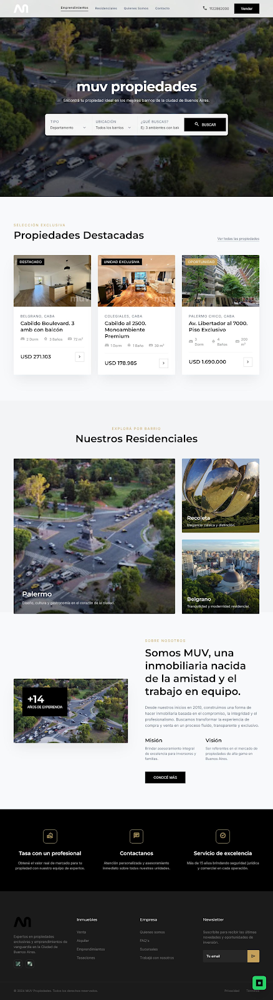
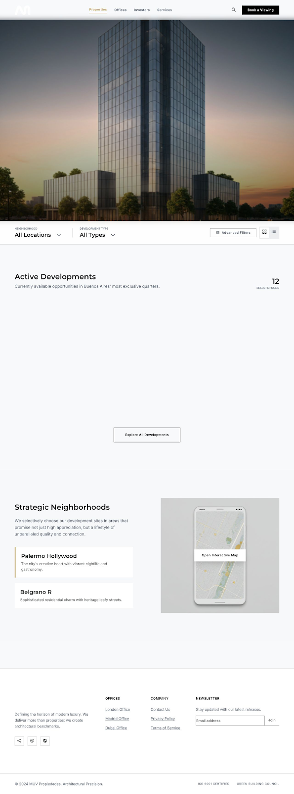
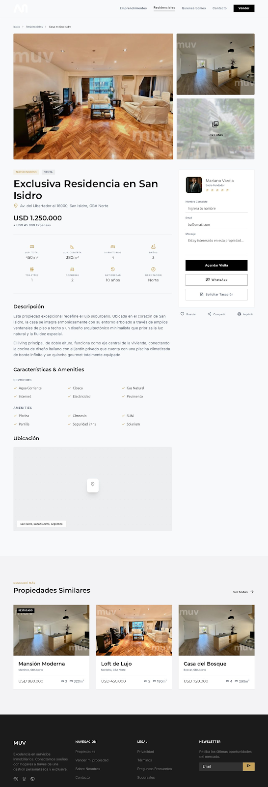

# 🏛️ MUV Propiedades — Plataforma Inmobiliaria Premium

<div align="center">
  
  <p><em>Definiendo el horizonte del lujo contemporáneo y desarrollos premium.</em></p>
</div>

---

**MUV Propiedades** es una aplicación web de vanguardia para la gestión y visualización de propiedades exclusivas y desarrollos inmobiliarios en las zonas más cotizadas de Buenos Aires (Recoleta, Palermo Chico, Belgrano, etc.).

La plataforma combina un diseño visual minimalista, animaciones fluidas y una integración directa en tiempo real con la API de **Tokko Broker**.

---

## 🚀 Tecnologías Principales

| Tecnología | Propósito | Descripción |
| :--- | :--- | :--- |
| **Astro (v4.x)** | Framework Core | Configurado en modo **SSR (Server-Side Rendering)** con el adaptador de Node para consultas de datos en tiempo real. |
| **Tailwind CSS** | Estilado y Layouts | Implementación de un sistema de diseño premium con una paleta de colores sofisticada (`refined-gold`, `slate-blue`, `pure-white`, `deep-charcoal`). |
| **Tokko Broker API** | Integración del Catálogo | Consultas directas de propiedades y unidades asociadas a emprendimientos con fallback automático a caché en ausencia de credenciales. |
| **Node.js / Express** | Servidor de Soporte | Soporte para rutas de API secundarias y carga de contenidos de prueba. |

---

## ✨ Características Premium Destacadas

### 🔹 Preloader de Entrada Elegante
Al cargar cualquier página de la web, se despliega una pantalla de precarga premium sobre un fondo oscuro, con un anillo de carga dorado giratorio lento rodeando el isotipo de MUV con efecto de latido continuo. Una vez cargados los recursos de la página, se desvanece de manera fluida y se desmonta del DOM.

### 🔹 Rediseño Completo de Ficha de Propiedad (`/property/[id]/`)
Estructura de página a pantalla completa que elimina las barras laterales tradicionales para enfocarse en la experiencia visual:
- **Cabecera de Acción**: Migas de pan, compartir ficha (copiar enlace al portapapeles) y agregar a favoritos (guardado persistente en almacenamiento local).
- **Galería de Imágenes**: Grid premium de 3 imágenes (una grande a la izquierda, dos apiladas a la derecha).
- **Barra Horizontal de Atributos**: Iconos modernos de especificaciones técnicas (Ambientes, Dormitorios, Baños, Metros Cuadrados).
- **Sección de Detalles**: Un bloque con fondo celeste suave que agrupa de manera limpia los datos duros de la propiedad.
- **Formulario de Contacto Centrado**: Diseñado para maximizar la tasa de conversión de clientes interesados.
- **Botón Flotante de WhatsApp**: Acceso rápido directo para chatear con un asesor.

### 🔹 Detalle de Emprendimientos y Unidades Disponibles (`/emprendimientos/[id]/`)
- **Remoción de Calculadoras Interactivas**: Simplificación de la interfaz a pedido de negocio, removiendo la calculadora de financiación CAC y su formulario de cotización.
- **Tabla de Unidades Rediseñada**: Tabla limpia y alineada a la izquierda que muestra exactamente los atributos clave de cada unidad: *Dirección, Ambientes, Dormitorios, Superficie Cubierta, Superficie Total, Cochera, Venta, Alquiler*.
- **Fila Clickeable**: El usuario puede hacer clic en cualquier fila de la tabla para acceder directamente a la ficha detallada de la unidad.

### 🔹 Enrutamiento y SEO Limpios
- Enrutamiento con **Trailing Slashes** activado de forma mandatoria en todo el sitio para consistencia y posicionamiento SEO (`/page/` en lugar de `/page`).
- Generación de metaetiquetas descriptivas e inserción de jerarquía semántica estructurada de encabezados.

---

## 📁 Estructura del Proyecto

```markdown
├── public/
│   ├── assets/              # Isotipos, logotipos y recursos multimedia locales
│   └── ...
├── src/
│   ├── components/          # Componentes reutilizables (Header, Footer, Gallery, etc.)
│   ├── layouts/             # Plantilla base (MainLayout con preloader incorporado)
│   ├── lib/                 # Integración de la API de Tokko Broker (tokko.ts)
│   ├── pages/               # Páginas y rutas de la aplicación (Astro)
│   │   ├── emprendimientos/
│   │   │   ├── [id].astro   # Ficha del proyecto y listado de unidades
│   │   │   └── index.astro  # Catálogo general de desarrollos
│   │   ├── property/
│   │   │   └── [id].astro   # Rediseño de la ficha de la propiedad
│   │   └── ...
│   └── styles/
│       └── global.css       # Configuración global y directivas de Tailwind CSS
├── astro.config.mjs         # Configuración del servidor Astro y trailingSlash
├── tailwind.config.cjs      # Configuración de tipografías y paleta de colores de Tailwind
└── package.json
```

---

## 🛠️ Configuración y Ejecución Local

### 1. Requisitos Previos
- Tener instalado **Node.js** (versión 18 o superior recomendada).

### 2. Archivo de Entorno (`.env`)
Creá un archivo `.env` en la raíz del proyecto para conectar la API de Tokko:
```env
TOKKO_API_KEY=tu_tokko_api_key_aqui
```
> Si no se provee la API Key, el sistema utilizará automáticamente datos mock para pruebas de desarrollo local.

### 3. Instalación de Dependencias
```bash
npm install
```

### 4. Modo de Desarrollo
Iniciá el servidor de desarrollo de Astro:
```bash
npm run dev
```
La aplicación estará disponible en `http://localhost:4321`.

Si necesitás ejecutar también el servidor mock de backend:
```bash
npm run start:static
```

### 5. Compilación para Producción
Para compilar la aplicación y comprobar que no existan errores de TypeScript o sintaxis en Astro:
```bash
npm run build
```

---

## 📸 Galería del Proyecto

A continuación se muestran algunas de las vistas del diseño actual implementado en la plataforma (disponibles en la carpeta [/screenshots](file:///home/elinux/Documentos/Antigravity/muv/screenshots)):

| Inicio / Buscador | Listado de Emprendimientos | Ficha de Propiedad |
| :---: | :---: | :---: |
|  |  |  |

---

<div align="center">
  <p>© 2026 MUV Propiedades. Desarrollado con precisión arquitectónica.</p>
</div>
